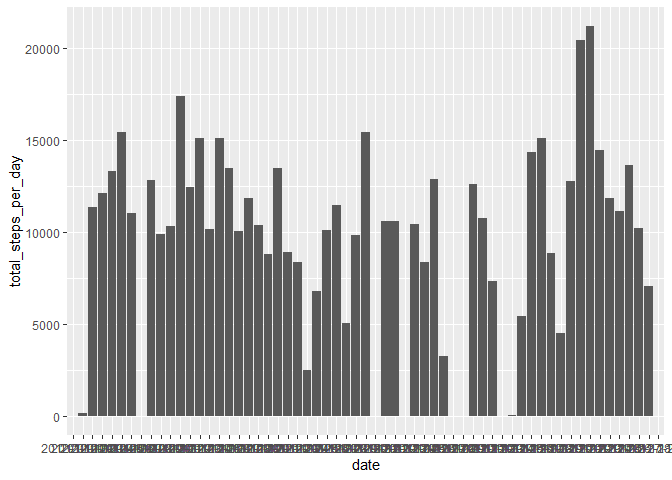
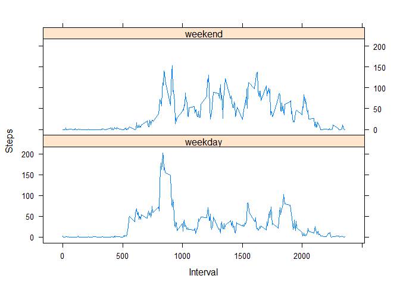

## Loading data


```r
activity_data <- read.csv(unzip("activity.zip", "activity.csv"), header = TRUE, sep = ",")
head(activity_data)
```

```
##   steps       date interval
## 1    NA 2012-10-01        0
## 2    NA 2012-10-01        5
## 3    NA 2012-10-01       10
## 4    NA 2012-10-01       15
## 5    NA 2012-10-01       20
## 6    NA 2012-10-01       25
```

## What is the mean total number of steps taken per day?

### Histogram with total number of steps per day


```r
activity_data %>% group_by(date) %>% summarise(total_steps_per_day = sum(steps)) %>% ggplot(aes(x = date, y = total_steps_per_day)) + geom_bar(stat = "identity")
```

```
## Warning: Removed 8 rows containing missing values (position_stack).
```

<!-- -->

### Mean and median of the total number of steps taken per day


```r
meanWithNAs <- activity_data %>% group_by(date) %>% summarise(total_steps_per_day = sum(steps)) %>% summarise(mean_steps = mean(total_steps_per_day, na.rm = TRUE))
medianWithNAs <- activity_data %>% group_by(date) %>% summarise(total_steps_per_day = sum(steps)) %>% summarise(median_steps = median(total_steps_per_day, na.rm = TRUE))
```
#### Mean of the total number of steps taken per day = 1.0766189\times 10^{4}
#### Median of the total number of steps taken per day = 10765

## What is the average daily activity pattern?

### Time series plot of the 5-minute interval and the average number of steps taken, averaged across all days

```r
stepsPerInterval <- aggregate(steps~interval, data=activity_data, mean, na.rm=TRUE)
plot(steps~interval, data=stepsPerInterval, type="l")
```

<!-- -->

#### 5-minute interval which contains maximum number of steps is 835

## Imputing missing values

#### Total number of missing values is 2304

### New data set with missing data filled in


```r
imputedSteps <- impute(activity_data$steps, median)
new_activity_data <- data.frame(steps = imputedSteps, date = activity_data$date, interval = activity_data$interval)
```

### Histogram with total number of steps per day with missing data filled in

```r
new_activity_data %>% group_by(date) %>% summarise(total_steps_per_day = sum(steps)) %>% ggplot(aes(x = date, y = total_steps_per_day)) + geom_bar(stat = "identity")
```

<!-- -->

```r
head(new_activity_data)
```

```
##   steps       date interval
## 1     0 2012-10-01        0
## 2     0 2012-10-01        5
## 3     0 2012-10-01       10
## 4     0 2012-10-01       15
## 5     0 2012-10-01       20
## 6     0 2012-10-01       25
```

### Mean and median of the total number of steps taken per day

```r
meanWithoutNAs <- new_activity_data %>% group_by(date) %>% summarise(total_steps_per_day = sum(steps)) %>% summarise(mean_steps = mean(total_steps_per_day, na.rm = TRUE))
medianWithoutNAs <- new_activity_data %>% group_by(date) %>% summarise(total_steps_per_day = sum(steps)) %>% summarise(median_steps = median(total_steps_per_day, na.rm = TRUE))
```
#### Mean of the total number of steps taken per day = 9354.2295082
#### Median of the total number of steps taken per day = 1.0395\times 10^{4}

### Difference between means and medians after imputing missing values
#### Mean difference = 1411.959171
#### Median difference = 370

## Are there differences in activity patterns between weekdays and weekends?

### Time series plot of the 5-minute interval and the average number of steps taken, averaged across all weekday days or weekend days


```r
new_activity_data$date <- as.Date(new_activity_data$date)
new_activity_data$day <- weekdays(new_activity_data$date)
for (i in 1:nrow(new_activity_data)) {
  if (new_activity_data[i,]$day %in% c("Saturday","Sunday")) {
    new_activity_data[i,]$day<-"weekend"
  }
  else{
    new_activity_data[i,]$day<-"weekday"
  }
}
aggregatedData <- new_activity_data %>% group_by(interval, day) %>% summarise(avg_steps = mean(steps, na.rm = TRUE))
xyplot(avg_steps ~ interval | day, data = aggregatedData, layout = c(1,2), type = "l", xlab = "Interval", ylab = "Steps")
```

<!-- -->
